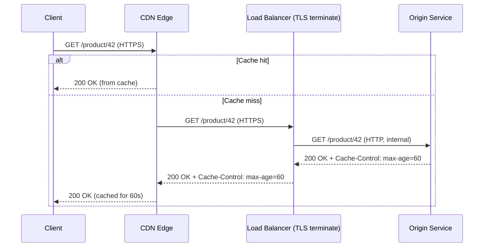

# Diagram: HTTP Request/Response Flow

Referenced from: [05_Networking_and_OS/CH01_HTTP.md](../../05_Networking_and_OS/CH01_HTTP.md)

```mermaid
sequenceDiagram
    participant C as Client
    participant CDN as CDN Edge
    participant LB as Load Balancer (TLS terminate)
    participant S as Origin Service

    C->>CDN: GET /product/42 (HTTPS)
    alt Cache hit
        CDN-->>C: 200 OK (from cache)
    else Cache miss
        CDN->>LB: GET /product/42 (HTTPS)
        LB->>S: GET /product/42 (HTTP, internal)
        S-->>LB: 200 OK + Cache-Control: max-age=60
        LB-->>CDN: 200 OK + Cache-Control: max-age=60
        CDN-->>C: 200 OK (cached for 60s)
    end
```
